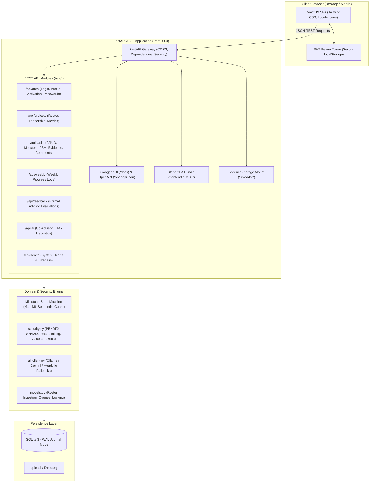
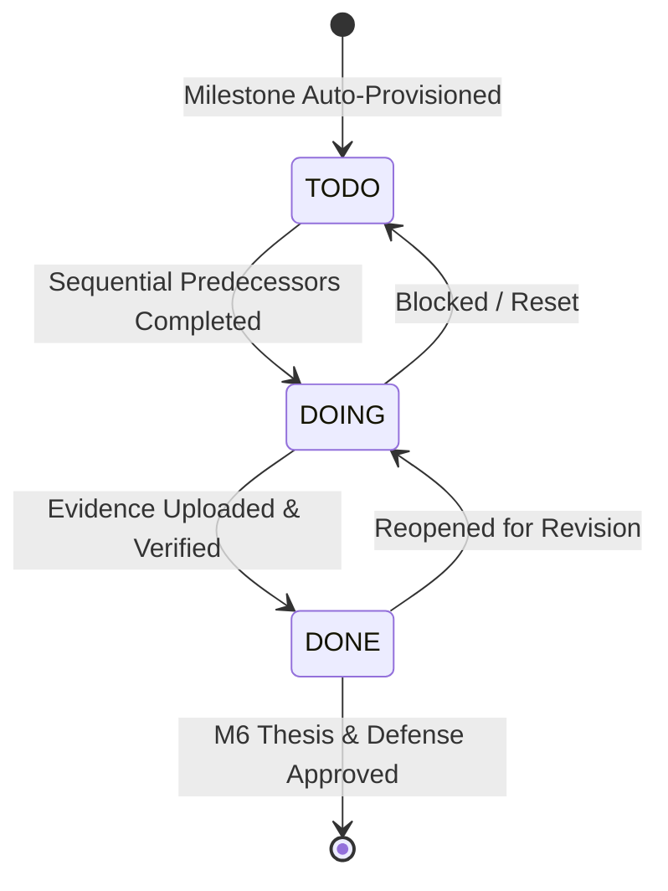

# 🎓 Bitirme Projesi Takip Sistemi (Capstone Project Tracker)

[](https://github.com/organization/capstone-project-tracker/actions/workflows/ci.yml)
[](https://www.python.org/)
[](https://nodejs.org/)
[](https://github.com/astral-sh/ruff)
[](https://docs.pytest.org/)
[](https://www.docker.com/)

A modern, production-ready capstone project management and academic milestone verification platform. The application features a **decoupled architecture** combining a high-performance **FastAPI** backend with a reactive **React 19 + Tailwind CSS** single-page application (SPA), backed by an **SQLite (WAL mode)** database with enterprise-grade security, sequential milestone enforcement, and local/cloud AI co-advisor capabilities.

---

## 🏗️ Decoupled System Architecture

The system operates either in **single-port unified mode** (port 8000 serves both REST API endpoints and static SPA assets) or in **independent hot-reloading development mode** (Vite on port 5173 proxying to FastAPI on port 8000).



---

## 🚀 Key Features

- **Decoupled Architecture:** Clean separation of concerns between FastAPI RESTful services and modern React 19 UI.
- **Single-Port Production Serving:** FastAPI directly serves the compiled React production bundle, documentation, and API endpoints on port `8000`.
- **Sequential Milestone Verification:** Tasks conform strictly to $M_1 \rightarrow M_6$. Higher milestones are locked until prior milestones are fully completed.
- **Mandatory Evidence Validation:** Submitting a milestone task to `DONE` requires valid verifiable evidence (HTTP URL or uploaded file).
- **Interactive OpenAPI / Swagger Docs:** Self-documenting API schemas and endpoint sandboxes available at `/docs` and `/redoc`.
- **Role-Based Access Control (RBAC):** Distinct permissions for Advisors (Admin), Team Leaders, and Student Members.
- **Bilingual Internationalization:** Full Turkish and English localization support.
- **AI Academic Co-Advisor:** Pluggable AI integration supporting local Ollama (`llama3.2:3b`), Google Gemini, and rule-based heuristic fallback engines.
- **Containerized Multi-Stage Builds:** Production-grade `Dockerfile` using Node 20 Alpine and Python 3.11-slim running as a non-privileged `appuser`.

---

## 🔑 Test Credentials & Demo Accounts

The system comes pre-configured with sample academic teams and accounts (seeded via `ogr.example.csv`):

| Role | Username / Identifier | Default Password | Permissions |
|:---|:---|:---|:---|
| **Admin Advisor** | `Dr. UFUK ASIL` | `12345` | Global roster upload, cross-project risk monitoring, advisor feedback, project administration |
| **Advisor** | `Dr. Ahmet Demir` | `12345` | Supervise assigned projects, review tasks, provide formal feedback |
| **Team Leader** | `210208001` (Ali Yılmaz) | `12345` | Assign project tasks, manage deliverables, log weekly updates |
| **Student Member** | `210208002` (Ayşe Demir) | `12345` | View project roadmap, update assigned task states, submit evidence |

> [!NOTE]
> All newly provisioned accounts are assigned the default password configured via `DEFAULT_PASSWORD` (`12345`). Users are prompted to update their password upon first authentication.

---

## 🔄 Milestone State Machine ($M_1 \rightarrow M_6$)

Students and leaders navigate six formalized senior engineering milestone phases:



| Milestone | Stage Description | Mandatory Evidence |
|:---:|:---|:---|
| **M1** | Literatür Taraması (Literature Review) | Research synthesis paper / bibliography file |
| **M2** | Algoritma ve Uygulama Planı (Architecture Plan) | System flowcharts, UML models, spec sheets |
| **M3** | Uygulamayı Boot Etme (Prototype Boot) | Git repository URL / runnable commit hash |
| **M4** | Uygulamayı Deneme ve Değerlendirme (Testing) | Test execution logs, benchmark reports |
| **M5** | Hataları Düzeltme ve Tekrar Deneme (Refinement) | Bug tracker reports, delta verification logs |
| **M6** | Proje Yazımı ve Final Rapor (Final Report) | Complete capstone thesis PDF & slide deck |

---

## 📡 REST API Reference & Swagger UI

FastAPI generates automatic OpenAPI documentation:
- **Swagger UI:** [http://localhost:8000/docs](http://localhost:8000/docs)
- **ReDoc:** [http://localhost:8000/redoc](http://localhost:8000/redoc)
- **Health Check:** `GET /api/health`

### Primary Endpoints Overview

| Category | Endpoint | Method | Description |
|:---|:---|:---:|:---|
| **Health** | `/api/health` | `GET` | Service liveness and version check |
| **Auth** | `/api/auth/login` | `POST` | Authenticate user, returns signed JWT bearer token |
| **Auth** | `/api/auth/me` | `GET` | Fetch authenticated user session profile |
| **Auth** | `/api/auth/advisors` | `GET` | List active advisors for login selection |
| **Projects** | `/api/projects` | `GET` | List projects (scoped by role & user assignment) |
| **Projects** | `/api/projects/{name}` | `GET` | Fetch project details, members, and metrics |
| **Projects** | `/api/projects/{name}/leader`| `PUT` | Assign or update project team leader |
| **Tasks** | `/api/tasks` | `GET` | List tasks for a project |
| **Tasks** | `/api/tasks` | `POST` | Create a new project milestone task |
| **Tasks** | `/api/tasks/{id}` | `PUT` | Update status, progress, or assignees (enforces FSM) |
| **Tasks** | `/api/tasks/{id}/evidence`| `POST` | Upload file deliverable or external evidence URL |
| **Tasks** | `/api/tasks/{id}/comments`| `GET/POST` | Read and append threaded task comments |
| **Weekly** | `/api/weekly/{project}` | `GET/POST` | List and submit weekly sprint logs |
| **Feedback** | `/api/feedback/{project}` | `GET/POST` | Formal academic feedback from advisors |
| **AI** | `/api/ai/evaluate` | `POST` | Automated milestone evaluation & guidance |

---

## 🐳 Containerization & Deployment

The system is packaged into a secure, multi-stage Docker container that builds the React application and serves it via FastAPI.

### Multi-Stage Build Strategy
1. **Stage 1 (`node:20-alpine`):** Compiles the React 19 frontend into optimized production bundles in `frontend/dist`.
2. **Stage 2 (`python:3.11-slim`):** Installs Python dependencies, copies backend code and compiled assets, creates a non-root `appuser`, and exposes port `8000`.

### 1. Launch with Docker Compose (Recommended)

```bash
docker compose up -d --build
```

- Application URL: [http://localhost:8000](http://localhost:8000)
- API Documentation: [http://localhost:8000/docs](http://localhost:8000/docs)
- Health Check: `curl http://localhost:8000/api/health`

**Storage Persistence:**
The compose file automatically allocates two named volumes:
- `app_data`: Persists the SQLite database (`/app/data/project_tracker.db`).
- `uploads_data`: Persists uploaded deliverables (`/app/uploads`).

### 2. Standalone Docker Build & Run

```bash
# Build the production image
docker build -t capstone-tracker:latest .

# Run the container
docker run -d \
  -p 8000:8000 \
  -v capstone_data:/app/data \
  -v capstone_uploads:/app/uploads \
  --name capstone-tracker \
  capstone-tracker:latest
```

---

## ⚙️ Local Development Setup

### Prerequisites
- **Python 3.10+** (Python 3.11 recommended)
- **Node.js 20+** and `npm`
- **SQLite 3**

### Option A: Unified Mode (Single Port 8000)

```bash
# 1. Clone repository
git clone https://github.com/organization/capstone-project-tracker.git
cd capstone-project-tracker

# 2. Setup Python environment
python -m venv .venv
source .venv/bin/activate       # Windows: .venv\Scripts\Activate.ps1
pip install --upgrade pip
pip install -r requirements.txt

# 3. Build React frontend
cd frontend
npm install
npm run build
cd ..

# 4. Start FastAPI server
python -m uvicorn server:app --host 0.0.0.0 --port 8000 --reload
```
Navigate to [http://localhost:8000](http://localhost:8000).

### Option B: Decoupled Development Mode (Hot-Reloading)

Run backend and frontend independently for instantaneous hot-reloading:

```bash
# Terminal 1 - Backend (FastAPI on Port 8000)
python -m uvicorn server:app --reload --port 8000

# Terminal 2 - Frontend (Vite Dev Server on Port 5173)
cd frontend
npm run dev
```
The Vite development server runs at [http://localhost:5173](http://localhost:5173) and automatically proxies API requests to `http://localhost:8000`.

---

## 🧪 Testing Suite & Quality Assurance

The project enforces high test coverage and strict linting.

```bash
# Execute Pytest test suite (80 tests)
pytest -v

# Run code style and lint analysis with Ruff
ruff check .

# Verify frontend build
cd frontend && npm run build
```

### Test Suite Structure

```
tests/
├── conftest.py                   # In-memory SQLite fixtures & isolation hooks
├── test_api.py                   # FastAPI REST integration tests, auth, IDOR, endpoints
├── test_security_and_auth.py     # PBKDF2 hashing, HMAC signing, brute-force lockout
├── test_milestones_and_tasks.py  # FSM transitions, sequential milestone locks, evidence
└── test_roster_and_models.py     # CSV parsing, roster sync, metrics, leadership
```

---

## 🔄 CI/CD Pipeline

The GitHub Actions workflow (`.github/workflows/ci.yml`) runs on every push and pull request:
1. **Frontend Validation:** Installs Node.js 20, runs `npm install`, and verifies `npm run build`.
2. **Backend Validation:** Executes across a **Python 3.10, 3.11, and 3.12** matrix.
3. **Static Analysis:** Validates code style and syntax with **Ruff**.
4. **Automated Testing:** Runs all 80 tests in the **Pytest** suite.

---

## 📄 License

Developed for academic capstone management at OSTİM Technical University. Distributed under the MIT License.
